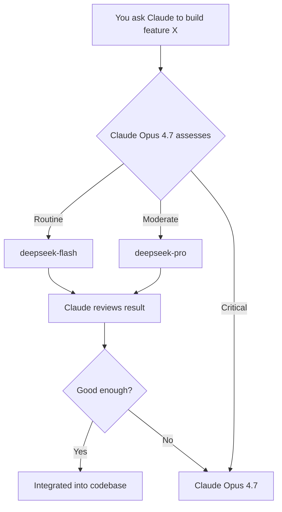

# 🧠 Claude‑DeepSeek Bridge

### You're paying for Claude Pro. You're still hitting limits by Wednesday.

[](https://opensource.org/licenses/MIT)
[](https://platform.deepseek.com/api_keys)
[](https://claude.ai/code)

**Sound familiar?**
You subscribed to Claude Pro. You're paying every month. And yet — every single week — you slam into the usage wall by Wednesday morning. The rest of the week? Degraded performance, throttled requests, and that sinking feeling when you realize you just burned half your limit on a CRUD endpoint you've written a hundred times before.

**That ends now.**

Claude‑DeepSeek Bridge gives Claude Code two new slash commands — **`/deepseek`** and **`/deepseek-pro`** — that let **Claude Opus 4.7** hand off routine and intermediate tasks to DeepSeek's fastest and most capable models. Claude stays in charge. Your limit stays intact. You ship every day of the week.

<p align="center">
  
</p>

---

## 🩸 The Wound

Claude Code with **Opus 4.7** is the best coding partner you've ever had. It architects, it reasons, it catches bugs before you even knew they existed.

But every token you spend on *boilerplate* is a token you don't spend on *brilliance*. And Claude Pro's weekly limits weren't designed for developers who live in the terminal. By day three, you're throttled. By day four, you're frustrated. By Friday? You're questioning your subscription.

## 🩹 The Fix: Two‑Tier Delegation

| Command | Model | Handles | Cost (per 1M tokens) |
|---------|-------|---------|----------------------|
| `/deepseek` | **DeepSeek V4 Flash** (`deepseek-chat`) | Boilerplate, unit tests, docs, regex, simple scripts, style fixes | $0.14 input / $0.28 output |
| `/deepseek-pro` | **DeepSeek V4 Pro** (`deepseek-reasoner`) | Complex refactors, debugging hypotheses, data analysis, non‑critical security checks | ~$0.55 input / $2.19 output |
| *(stays with Claude)* | **Claude Opus 4.7** | Architecture, critical security, complex business logic, final reviews | $15 input / $75 output |

**Claude still drives.** It decides what to delegate. It reviews every response. It integrates everything. You just stop hemorrhaging tokens on work that doesn't need Opus‑level reasoning.



---

## 📊 Real Numbers

| Scenario | Weekly Token Spend | Limits Hit? | Weekly Cost |
|----------|-------------------|-------------|-------------|
| Pure Claude Opus 4.7 (typical heavy week) | 800K output tokens | ✅ Yes — by Wednesday | ~$60 of your Pro allowance |
| Claude Opus 4.7 + DeepSeek Flash only | 200K (Opus) + 600K (Flash) | ❌ No — coasting all week | ~$15 Opus + ~$0.17 Flash |
| Claude Opus 4.7 + Flash + Pro | 150K (Opus) + 450K (Flash) + 200K (Pro) | ❌ No — full power, all week | ~$11 Opus + ~$0.13 Flash + ~$0.44 Pro |

> 💡 **You're not downgrading. You're load‑balancing.** Claude Opus 4.7 does what only Claude Opus 4.7 can do. Everything else goes to models that cost pocket change.

---

## 🚀 Install in 30 Seconds

### Prerequisites
- [Claude Code](https://claude.ai/code) (with Pro subscription — you're going to protect that investment)
- Python 3.8+
- [DeepSeek API Key](https://platform.deepseek.com/api_keys) (free account, pay‑per‑use at fractions of a cent)

### One‑Command Setup

```bash
git clone https://github.com/joh3d/Claude-deepseek-bridge.git
cd Claude-deepseek-bridge
bash setup.sh
```
