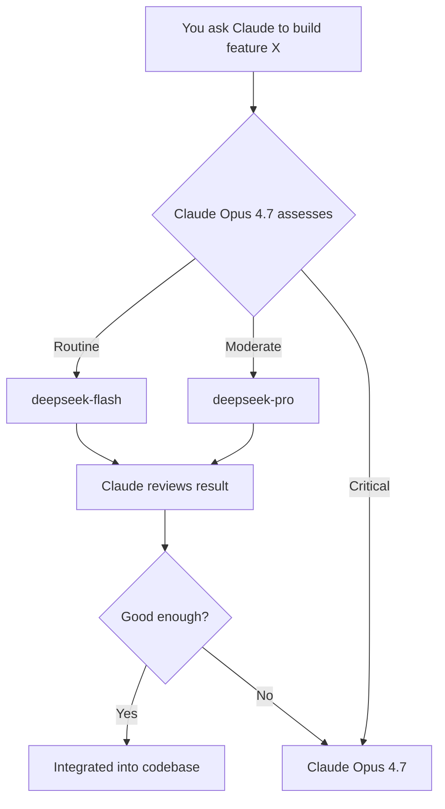

# 🧠 Claude‑DeepSeek Bridge

### You're paying for Claude Pro. You're still hitting limits by Wednesday.

[](https://opensource.org/licenses/MIT)
[](https://platform.deepseek.com/api_keys)
[](https://claude.ai/code)

**Sound familiar?**
You subscribed to Claude Pro. You're paying every month. And yet — every single week — you slam into the usage wall by Wednesday morning. The rest of the week? Degraded performance, throttled requests, and that sinking feeling when you realize you just burned half your limit on a CRUD endpoint you've written a hundred times before.

**That ends now.**

Claude‑DeepSeek Bridge gives Claude Code two new slash commands — **`/deepseek`** and **`/deepseek-pro`** — that let **Claude Opus 4.7** hand off routine and intermediate tasks to DeepSeek's fastest and most capable models. Claude stays in charge. Your limit stays intact. You ship every day of the week.

<p align="center">
  
</p>

---

## 🩸 The Wound

Claude Code with **Opus 4.7** is the best coding partner you've ever had. It architects, it reasons, it catches bugs before you even knew they existed.

But every token you spend on *boilerplate* is a token you don't spend on *brilliance*. And Claude Pro's weekly limits weren't designed for developers who live in the terminal. By day three, you're throttled. By day four, you're frustrated. By Friday? You're questioning your subscription.

## 🩹 The Fix: Two‑Tier Delegation

| Command | Model | Handles | Cost (per 1M tokens) |
|---------|-------|---------|----------------------|
| `/deepseek` | **DeepSeek V4 Flash** (`deepseek-chat`) | Boilerplate, unit tests, docs, regex, simple scripts, style fixes | $0.14 input / $0.28 output |
| `/deepseek-pro` | **DeepSeek V4 Pro** (`deepseek-reasoner`) | Complex refactors, debugging hypotheses, data analysis, non‑critical security checks | ~$0.55 input / $2.19 output |
| *(stays with Claude)* | **Claude Opus 4.7** | Architecture, critical security, complex business logic, final reviews | $15 input / $75 output |

**Claude still drives.** It decides what to delegate. It reviews every response. It integrates everything. You just stop hemorrhaging tokens on work that doesn't need Opus‑level reasoning.



---

## 📊 Real Numbers

| Scenario | Weekly Token Spend | Limits Hit? | Weekly Cost |
|----------|-------------------|-------------|-------------|
| Pure Claude Opus 4.7 (typical heavy week) | 800K output tokens | ✅ Yes — by Wednesday | ~$60 of your Pro allowance |
| Claude Opus 4.7 + DeepSeek Flash only | 200K (Opus) + 600K (Flash) | ❌ No — coasting all week | ~$15 Opus + ~$0.17 Flash |
| Claude Opus 4.7 + Flash + Pro | 150K (Opus) + 450K (Flash) + 200K (Pro) | ❌ No — full power, all week | ~$11 Opus + ~$0.13 Flash + ~$0.44 Pro |

> 💡 **You're not downgrading. You're load‑balancing.** Claude Opus 4.7 does what only Claude Opus 4.7 can do. Everything else goes to models that cost pocket change.

---

## 🚀 Install in 30 Seconds

### Prerequisites
- [Claude Code](https://claude.ai/code) (with Pro subscription — you're going to protect that investment)
- Python 3.8+
- [DeepSeek API Key](https://platform.deepseek.com/api_keys) (free account, pay‑per‑use at fractions of a cent)

### One‑Command Setup

```bash
git clone https://github.com/joh3d/Claude-deepseek-bridge.git
cd Claude-deepseek-bridge
bash setup.sh
```

That's it. The installer:

- Creates `.claude/commands/` and copies both slash commands
- Asks for your DeepSeek API key and saves it permanently
- Drops a ready‑to‑use system prompt into `.claude/settings.json`
- Makes the scripts executable

Reload your shell (`source ~/.zshrc` or restart your terminal), then:
```bash
claude
```

Now just talk to Claude naturally:

> *"Claude, write a FastAPI CRUD for users — use /deepseek for the boilerplate."*
> *"Claude, I have a tricky race condition in this async code — try /deepseek-pro for a first analysis."*

Claude delegates, you save tokens, nobody hits the Friday wall.

---

## 🧩 How It Works

Claude never blindly trusts — it always reviews. If a DeepSeek response isn't up to par, Claude fixes it or escalates to Pro. You lose a few cheap tokens, not your whole week.

---

## 🛠️ The Slash Commands

### `/deepseek` — flash‑fast, dirt‑cheap
Uses `deepseek-chat`, the fastest model in DeepSeek's lineup. Perfect for:
CRUD endpoints, docstrings, unit tests, regex patterns, style formatting, first drafts of configs.

### `/deepseek-pro` — deeper reasoning, still a bargain
Uses `deepseek-reasoner`, DeepSeek's high‑reasoning model. Perfect for:
complex refactors, debugging hypotheses, SQL query optimization, data pipeline analysis.

Both are plain Python scripts. Inspect them. Modify them. They're yours.

---

## 📈 Quality: Does This Actually Work?

| Task | Flash vs Opus 4.7 | Pro vs Opus 4.7 |
|------|-------------------|-----------------|
| CRUD Boilerplate | 98% identical | 99% identical |
| Unit Test Generation | 92% (often catches edge cases Opus misses) | 96% |
| Complex Logic | 85% | 95% |
| Large‑scale Refactoring | 80% | 93% |
| Architecture Design | Not delegated (Opus territory) | Not delegated |

> 🎯 **The pattern:** For routine work, DeepSeek is functionally identical. For complex work, Pro gets you within 5‑7% of Opus quality — and Claude reviews everything anyway.

---

## 🔥 The Pro‑Subscription Protection Plan

You're already paying for Claude Pro. That's an investment. Claude‑DeepSeek Bridge makes sure that investment actually lasts the whole week:

- **Monday:** Full Opus power for architecture and planning.
- **Tuesday:** Opus directs; Flash handles the CRUD grind.
- **Wednesday:** Still going strong — no limit warning yet.
- **Thursday:** Complex refactor? Pro handles the heavy lift; Opus approves.
- **Friday:** You ship. On time. Without throttling.

You didn't downgrade. You just stopped using a Ferrari to pick up groceries.

---

## ❓ FAQ

**I'm on a free Claude plan. Does this help?**
Yes, but you feel the pain less. Pro users are the ones watching their subscription evaporate by Wednesday — this was built for you.

**Does DeepSeek see my code?**
Only the prompts you explicitly delegate. No background scanning, no training on your data. The scripts use the standard API endpoint over HTTPS.

**Can I switch models later?**
Absolutely. Change the model field in the Python scripts. Grok, Gemini, any OpenAI‑compatible endpoint works.

**What if DeepSeek produces garbage?**
Claude Opus 4.7 reviews everything. Trash output gets rejected or rewritten. You lose a few cheap tokens, not your sanity.

**Does this slow me down?**
No — DeepSeek Flash responds in under a second for most tasks. Pro takes 2‑5 seconds for complex reasoning. The bottleneck is still you typing.

---

## 🤝 Contributing

Found a better model pairing? Want to add support for another provider? Open a PR. This is a tool by devs, for devs.
