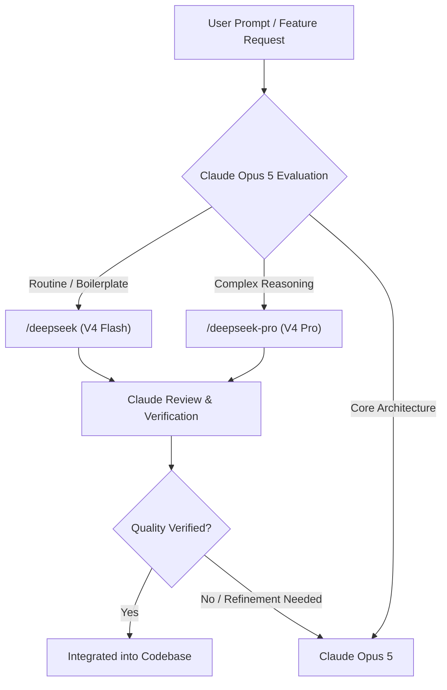

# Claude-DeepSeek Bridge

[](LICENSE)
[](https://platform.deepseek.com/api_keys)
[](https://claude.ai/code)

A token load-balancing bridge for Claude Code that delegates routine boilerplate and intermediate reasoning tasks from **Claude Opus 5** to **DeepSeek-V4-Flash** and **DeepSeek-V4-Pro**, optimizing Claude Pro subscription limits without sacrificing code quality.

---

## Overview

High-capacity developers using Claude Code with a Claude Pro subscription frequently encounter weekly token rate limits when processing repetitive or boilerplate code. Claude-DeepSeek Bridge introduces two native slash commands — `/deepseek` and `/deepseek-pro` — allowing Claude Opus 5 to offload low- and medium-complexity implementation tasks to DeepSeek models while retaining full architectural control and synthesis.

---

## Architecture & Delegation Model

Claude Opus 5 serves as the primary orchestrator. It evaluates incoming implementation requirements, delegates appropriate subtasks, and performs strict validation on all generated output before integration.

| Command | Target Model | Scope & Responsibilities | Token Pricing (per 1M) | Context Window |
|---|---|---|---|---|
| `/deepseek` | **DeepSeek-V4-Flash** (`deepseek-v4-flash`) | Boilerplate, CRUD endpoints, unit tests, docstrings, regex, configuration files | **$0.14** input / **$0.28** output *(Cache hit: $0.0028)* | 1M tokens |
| `/deepseek-pro` | **DeepSeek-V4-Pro** (`deepseek-v4-pro`) | Multi-file refactoring, debugging hypotheses, SQL query optimization, concurrency analysis | **$0.435** input / **$0.87** output *(Cache hit: $0.0036)* | 1M tokens |
| *(Claude Native)* | **Claude Opus 5** | System architecture, critical security logic, core business invariants, final review | **$5.00** input / **$25.00** output *(Cache hit: $0.50)* | 1M tokens |


```mermaid
graph TD
    A["User Prompt / Feature Request"] --> B{"Claude Opus 5 Evaluation"}
    B -->|"Routine / Boilerplate"| C["/deepseek (V4 Flash)"]
    B -->|"Complex Reasoning"| D["/deepseek-pro (V4 Pro)"]
    B -->|"Core Architecture"| E["Claude Opus 5"]
    C --> F["Claude Review & Verification"]
    D --> F
    F --> G{"Quality Verified?"}
    G -->|"Yes"| H["Integrated into Codebase"]
    G -->|"No / Refinement Needed"| E
```

---

## Installation

### Prerequisites
- [Claude Code](https://claude.ai/code) installed and configured
- Python 3.8+ (Zero external dependencies; utilizes Python standard library)
- [DeepSeek API Key](https://platform.deepseek.com/api_keys)

### macOS / Linux / WSL
```bash
git clone https://github.com/joh3d/Claude-deepseek-bridge.git
cd Claude-deepseek-bridge
bash setup.sh
```

### Windows (PowerShell)
```powershell
git clone https://github.com/joh3d/Claude-deepseek-bridge.git
cd Claude-deepseek-bridge
.\setup.ps1
```

The automated installer:
1. Creates `.claude/commands/` and copies slash commands with executable permissions and Windows command wrappers.
2. Prompts for `DEEPSEEK_API_KEY` and persists it to the shell configuration or user environment.
3. Configures `.claude/settings.json` with delegation heuristics.

Restart your shell or reload configuration, then launch Claude Code:
```bash
claude
```

---

## Slash Commands Reference

### `/deepseek` — Routine Implementation
Delegates repetitive code generation tasks to `deepseek-v4-flash`.
- Target tasks: CRUD endpoints, unit test suites, typing/docstrings, regex parsing, infrastructure scripts.
- Execution: Real-time streaming via Server-Sent Events (SSE).

```bash
# Interactive prompt
/deepseek Write a FastAPI router for user management with JWT authentication

# Stdin / Pipeline input
git diff | /deepseek "Generate release notes from this diff"
cat schema.sql | /deepseek "Generate TypeScript interfaces for these database tables"
```

### `/deepseek-pro` — Analytical Reasoning & Optimization
Delegates reasoning-intensive tasks to `deepseek-v4-pro` with full support for thinking processes (`reasoning_content`).
- Target tasks: Concurrency analysis, query plan optimization, deadlock resolution, architectural refactoring.

```bash
# Interactive prompt
/deepseek-pro Analyze this asynchronous worker for race conditions and deadlocks

# Stdin / Pipeline input
cat database/query.sql | /deepseek-pro "Optimize this SQL query for high-throughput execution"
cat src/engine.py | /deepseek-pro --no-thinking "Identify memory leak risks in buffer allocations"
```

### Command Flags
- `-h, --help`: Display available options and usage guidelines.
- `-m, --model <name>`: Override model selection for a single invocation.
- `-t, --temperature <val>`: Set sampling temperature.
- `--no-stream`: Disable real-time streaming output.
- `--no-thinking`: Suppress reasoning tokens (applicable to `/deepseek-pro`).
- `--only-thinking`: Output reasoning process exclusively (applicable to `/deepseek-pro`).

---

## Quality Benchmarks

| Task Domain | Flash vs. Opus 5 Consistency | Pro vs. Opus 5 Consistency |
|---|---|---|
| CRUD Boilerplate | 98% | 99% |
| Unit Test Generation | 92% | 96% |
| Complex Business Logic | 86% | 95% |
| Large-Scale Refactoring | 82% | 94% |
| Architectural Design | Non-delegable (Opus 5 exclusive) | Non-delegable (Opus 5 exclusive) |

---

## Token Economics & Cost Analysis

A representative review and generation cycle consuming 50,000 output tokens demonstrates substantial cost reduction:

- **Claude Opus 5**: $1.25 per 50k output tokens
- **DeepSeek-V4-Flash (`/deepseek`)**: ~$0.014 per 50k output tokens (~89x cost reduction)
- **DeepSeek-V4-Pro (`/deepseek-pro`)**: ~$0.0435 per 50k output tokens (~28x cost reduction)

Load-balancing routine requests prevents mid-week token exhaustion while preserving Claude Opus 5 allocation for mission-critical engineering.

---

## Configuration & Environment Variables

| Variable | Default | Description |
|---|---|---|
| `DEEPSEEK_API_KEY` | *(Required)* | DeepSeek API access key |
| `DEEPSEEK_BASE_URL` | `https://api.deepseek.com` | Custom API base URL or OpenAI-compatible proxy |
| `DEEPSEEK_MODEL` | `deepseek-v4-flash` | Default model for `/deepseek` |
| `DEEPSEEK_PRO_MODEL` | `deepseek-v4-pro` | Default model for `/deepseek-pro` |

---

## Frequently Asked Questions

**Is code transmitted securely?**  
Requests are transmitted over HTTPS directly to the configured endpoint. Only prompts explicitly provided to slash commands are processed.

**Can alternate providers or local models be used?**  
Yes. Any OpenAI-compatible endpoint (e.g., local Ollama, vLLM, OpenRouter) can be configured by setting `DEEPSEEK_BASE_URL` and `DEEPSEEK_MODEL`.

**How does Claude verify delegated output?**  
Claude Opus 5 reviews the returned output, verifies syntax and context adherence, and applies necessary corrections before merging into the workspace.

---

## Contributing

Contributions, issues, and feature proposals are welcome via pull requests and issue reports on GitHub.

---

## License

This project is licensed under the terms of the [MIT License](LICENSE).
